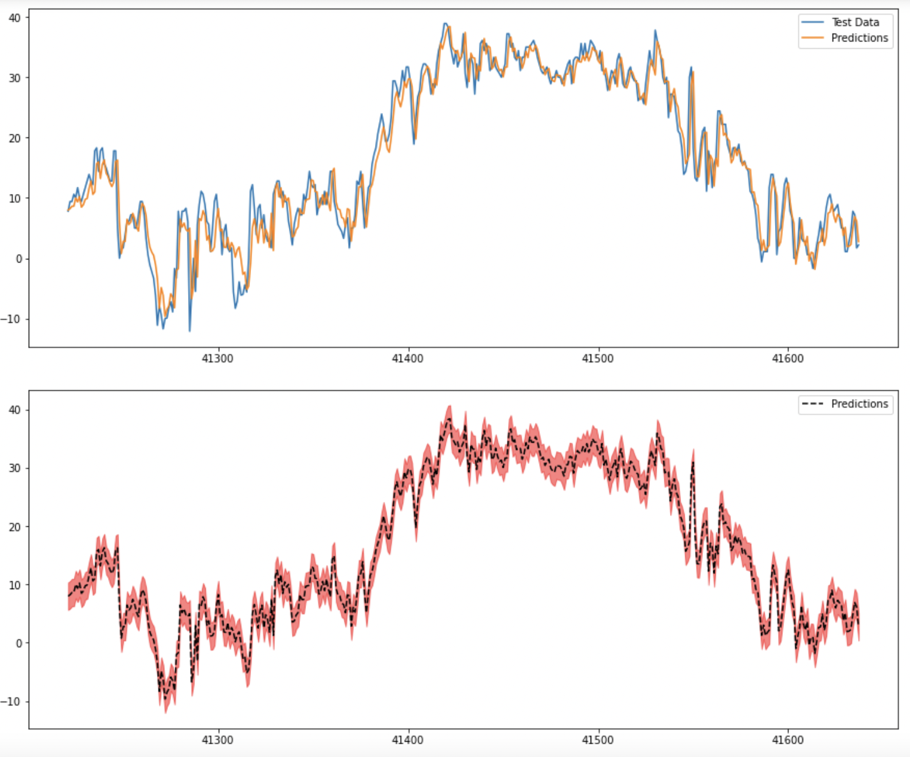

# Climate Change Analysis

## Overview of the Project

Climate Change is one of the most critical issues of our time. From change in weather patterns that impact food production, to rising sea levels that increase the risk of catastrophic flooding, spreading wildfires the impacts of climate change are global in scope and unprecedented in scale.

Through this analysis using historical climate data would visualize how climate change has been happening over the years across states in US

Using machine learning algorithm predict what would happen in the upcoming years and show how climate change is impacting US. 

## Resources
- Data Source
  - URL: https://www.ncei.noaa.gov/pub/data/ghcn/daily/by_year
  - National Centers for Environmental Information keeps track of the climate metrics across the world.
  - The core metrics are
    1. TMAX - Max Temperature
    2. TMIN - Min Temperation
    3. PRCP - Precipitation
    2. SNOW - Snow Depth
  - The data is available based on stations. Using a mapping table we can map station to state or countries.  
- Software: Python, Google Colab, Jupyter Notebook
- Communication Protocol: Slack, Git PRs and Meetings

---

## Results

### Exploratory Data Analysis

Using the NCEI data browsed through all the years and collected the required dataset. Initial analysis required few data restructuring with quality filtering to get a usable dataset.

### Database

Initial DB Design is built based on climate Data as below:

### Machine Learning

Also build models using Arima and Tensor Flow on time series data. Initial study shows better accuracy with Tensor Flow.

---

## Summary

To be filled later part of the project.
