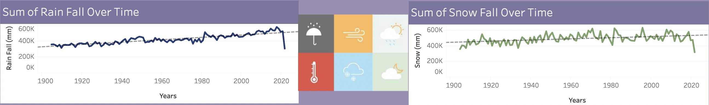

# Climate Change Analysis

## Overview of the Project

Climate Change is one of the most critical issues of our time. From change in weather patterns that impact food production, to rising sea levels that increase the risk of catastrophic flooding, spreading wildfires the impacts of climate change are global in scope and unprecedented in scale.

This project would involve an intial data exploration of the data available, understanding patterns through different visualizations to see climate change in US across different states, building a database to store the required information for view and using machine learning to predict the future of weather. 

## Resources
- Data Source
  - URL: https://www.ncei.noaa.gov/pub/data/ghcn/daily/by_year
  - National Centers for Environmental Information keeps track of the climate metrics across the world.
  - The core metrics are
    1. TMAX - Max Temperature
    2. TMIN - Min Temperation
    3. PRCP - Precipitation
    2. SNOW - Snow Depth
  - The data is available based on stations. Using a mapping table we can map station to state or countries.  
- Software: Python, Google Colab, Jupyter Notebook
- Communication Protocol: Slack, Git PRs and Meetings

---

## Results

### Exploratory Data Analysis

National Centers of Environmental Information maintains data from different stations all over the world with different metrics like temperature max/min, snow depth, precipitation and many more. They also provide data with details of stations. All this data was available in this URL - https://www.ncei.noaa.gov/pub/data/ghcn/daily/. 

Data was available in different formats and the station data involved data for each month in a row with a column for each day of the month. Initial work was done to convert this data into a row for each day. But with additional research we identified a similar dataset was available in the yearly folder.

With the data being so huge, we build a loop to download one year at a time using python requests, perform the necessary aggregations/lookup and store only the required data into the required metric files

Code Here: https://github.com/MoenJohn/capstone_climate_project/blob/main/data_setup/data_pull_and_cleanup.ipynb

### Database

Initial data was built using daily data from stations. This had the following structure:
 - station_id varchar pk fk >- stations.
 - station_id
 - date date pk
 - metric varchar
 - value float
 - measurement_flag varchar
 - quality_flag varchar
 - source_flag varchar 
 - observation_time int 

To get to the values by state, a lookup table was built referring station code to state code
 - station_id varchar pk
 - latitude float
 - longitude float
 - elevation float
 - state_code varchar FK >- states.state_code
 - station_name varchar

Now selecting just the required states and country based on station id name, data was aggregated to daily , monthly and yearly levels for our analysis.

Below is the ERD of tables used for our research.

The data was loaded to a sqllite DB using SQLAlchemy.

Code here: https://github.com/MoenJohn/capstone_climate_project/blob/main/database/database_sqlite.ipynb

Below is the sample view of the database query page: 

### Visualizations

After data collection once the trends were put up there was a clear indication of how climate is changing all over US.

1. The below graph shows out the max and min temperation has been varying each year, we can clearly see in the depicted red line how the min temperation is reducing and max temperature is increase year over year.

2. Using the average of a decade, here it was compared to current decade, the below shows the change from 1960's to 2010's

3. Similar to above the below shows the comparison minimum temperature of 1960 decade to 2010 

4. Below are the 2 images for average max/min temperature over the last 120 years and indicating the upward / downward trend.

5. Below shows the top states with rain and snow

6. Below shows the trends of rain and snow over the last 120 years.

Links: 
Dashboard 1: https://public.tableau.com/views/FinalProject7_16613026204870/Dashboard1?:language=en-US&:display_count=n&:origin=viz_share_link
Dashboard 2: https://public.tableau.com/views/FinalProject7_2/Dashboard2?:language=en-US&:display_count=n&:origin=viz_share_link

### Machine Learning

Using Gradient Boosting for Regression we were able to split our input features into year, month and day. In the analysis by taking a specific state and metric we were able to predict both for past and future dates. Analysis Code here: https://github.com/MoenJohn/capstone_climate_project/blob/main/model/gbr/GradientBoostingRegressorAnalysis.ipynb

Using this analysis code was updated to a helper object to take the inputs and generate the prediction using the required model. Code here: https://github.com/MoenJohn/capstone_climate_project/blob/main/web_app/gbrModelHelper.py

Below is a sample view of the machine learning page:

### Web App

The foundation of the web application was a free template from html5up.net, https://html5up.net/solid-state. For the color scheme we decided to look through themes that were darker and more foreboding than others, looking to bring depth to our data storytelling and this template brought the correct atmosphere. It also had built in css for data tables and input forms which we would need for our database and machine learning pages.

A flask app was built on top of these pages. The pages were designed with our requirements, Javascripts, Images and other updates to get it functional

Here is the home page view of the application:

The final application was deployed to heroku. Link here: http://uom-capstone-climate-change.herokuapp.com/

---

## Summary

All the required analysis was completed as part of this project including data exploration and analysis, visualizations, database, machine learning and putting all of this into a web application. 

We see trends that are important to understand and looked at to improve the climate for the future.
